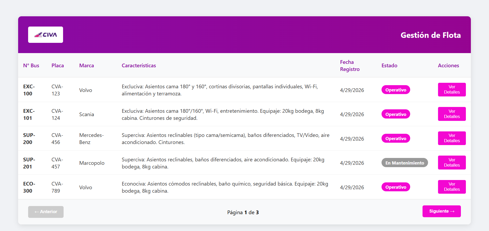
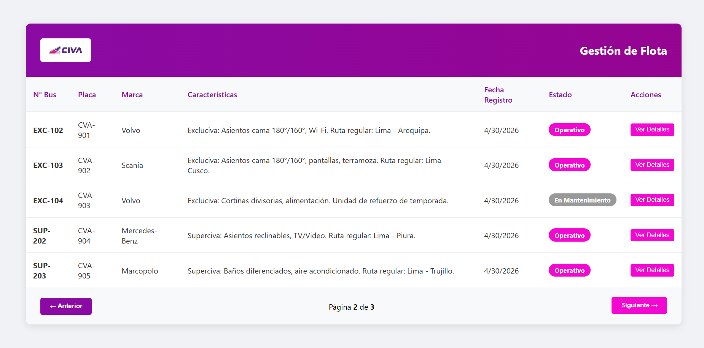
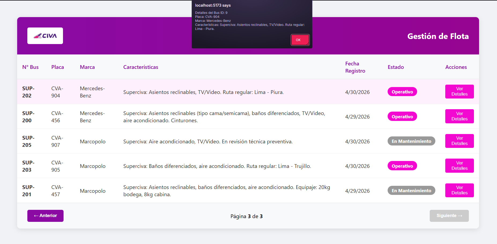

# Reto Técnico CIVA - Desarrollador FullStack

Este repositorio contiene la solución al reto técnico para el puesto de Desarrollador FullStack. El proyecto consiste en una aplicación de gestión de flota de buses dividida en una API REST (Backend) y una interfaz de usuario (Frontend).

## Características y Puntos Extra Implementados

Se han cumplido todas las consideraciones obligatorias y se han añadido los siguientes requerimientos opcionales y buenas prácticas:

* **Arquitectura Limpia:** Separación por capas (Controller, Service, Repository, DTO, Model, Exception) en el Backend.
* **Manejo Global de Excepciones:** Respuestas JSON estructuradas y limpias usando `@RestControllerAdvice`.
* **Optimización de Base de Datos:** Uso de `JOIN FETCH` y `@Transactional(readOnly = true)` para evitar el problema de consultas N+1.
* **Paginación Nativa:** Implementada tanto en la base de datos (Spring Data JPA) como en el consumo desde el Frontend.
* **Seguridad (CORS):** Configurado a través de `SecurityConfig` para permitir consumo estricto desde el Frontend.
* **Frontend Moderno:** Uso de React 18 con **TypeScript** y empaquetado con Vite para máximo rendimiento.

---

## Demostración de la Aplicación

![Demostración de la App]

---

## 🛠️ Tecnologías Utilizadas

**Backend:**
* Java 26
* Spring Boot 4.0.6
* PostgreSQL Driver
* Lombok

**Frontend:**
* React 18
* TypeScript
* Vite
* CSS 

---

## Guía de Instalación y Ejecución

### Prerrequisitos
* Java 17 o superior.
* Node.js (v18+) y npm.
* PostgreSQL (v13+).

### 1. Configuración de la Base de Datos
1. Abre tu gestor de PostgreSQL (pgAdmin).
2. Crea una base de datos vacía llamada `civa`.
3. (Opcional) Las tablas se crearán automáticamente con Hibernate. Puedes ejecutar el script SQL adjunto en el repositorio para poblar datos de prueba.

### 2. Levantar el Backend (Spring Boot)
1. Navega a la carpeta del backend:
   ```bash
   cd Backend
   cd app
2. Verifica application.properties encontraras el usuario (Civa) y contraseña(1234) de la base de datos, si no coinciden con tu entorno de desarrollo, cámbialos

3. Ejecuta el backend
   ```bash
   ./mvnw spring-boot:run

### 3. Levantar el Frontend 
1. Ingresa a la carpeta del Frontend
   ```bash
   cd Frontend

2. Instala las dependencias
   ```bash
   npm install
   ```

3. Ejecuta el frontend
   ```bash
   npm run dev
   ```

## Endpoints 

| Método | Endpoint | Descripción | Parámetros (Opcionales) |
| --- | --- | --- | --- |
| GET | /bus | Obtiene la lista de todos los buses registrados. | ?page=0&size=5 (Paginación) |
| GET | /bus/{id} | Obtiene la información detallada de un bus específico por su ID. | Variable de ruta id |

  
   